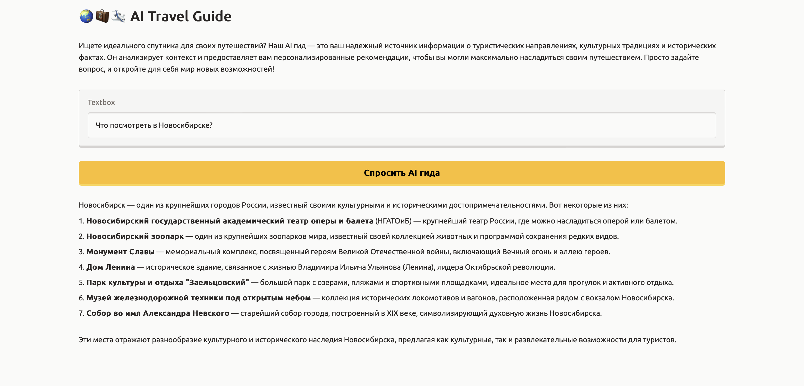

# 🌏🧳🛩️  AI Travel Guide
> Ассистент путешественника, который предоставляет информацию о культурных особенностях, обычаях и достопримечательностях по запросу пользователя о месте.


Пример работы приложения.

## Запуск

Для запуска приложения локально выполните следующие шаги:

1. Установите необходимые зависимости:
   ```
   pip install -r requirements.txt
   ```

2. Если запускаете приложение впервые, то скачайте данные для RAG из [папки](https://drive.google.com/drive/folders/1dhHJ3O13BXpIk2hqkezMwfl7fUVgGgsy?usp=sharing) и положите в папку data в корне репозитория. При запуске данные будут проиндексированы и записаны в vectorstore.

3. Приложение использует LLM GigaChat по API, поэтому для коррректной работы необходимо добавить ключ API_KEY в файл `.env`

4. Запустите Gradio приложение следующей командой:
   ```
   python app.py
   ```

5. После запуска приложение будет доступно на localhost или по публичной ссылке

## Структура репозитория
```
├── src
│   ├── data -- парсинг и предобработка данных
|       ├── data_parsing.py -- парсинг данных с wiki-ресурсов
|       └── data_processing.py -- предобработка данных перед индексацией
|   ├── rag.py -- собственно RAG
|   ├── retriever.py -- Retriever для индексации и создания vectorstore
|   └── interface.py -- интерфейс на Gradio
|
├── app.py -- основное приложение
├── validation_ragas.py -- валидация с помощью Ragas
└── requirements.txt -- зависимости
```

## Валидация результатов

### Генерация вопросов для валидации

- Модель - gpt-4o-mini
- Вход - чанки текстов, которые получается при препроцессинге. Количество - 50.
- Промпт - "Напиши по одному вопросу для каждого текста. Тексты отделены запятой."
- Вопросы - 'questions' в `chunks_joined.json`

### Генерация ответов

Ответы генерировались c помощью GigaChat-Lite:

   - с использование контекста (rag_answers)
   - без использования контекста, только с промптом (giga_chat_answers)

Часть вопросов в итоге была удалены из-за "Giga generation stopped with reason: blacklist"

Результат - [validation_data.json](https://drive.google.com/file/d/1suoyveha2bU3QqWdSGKeVMl6pP7M7kXy/view?usp=sharing)

### Оценка

Мы использовали два метода оценки:

- Side by side сравнение с ответами без RAG с gpt-4o-mini в качестве оценщика
- Оценка при помощи стандарных метрик из библиотеки Ragas

#### Side by side сравнение

- Модель - **gpt-4o-mini**
- Промпт - "Ответь 1, если лучше answer_a, иначе ответь 2. Формат ответа json."
- Вопросы - 'remained_questions' в `validation_data.json`
- Ответы были случайным образом перемешаны, чтобы минимизировать влияние позиции ответа на оценку модели.

**Результат**
|  |  Количество выбранных ответов моделью |
|---------------------------------------|---|
| rag_answers                           | 44|
| giga_chat_answers                     | 20|
| Всего                                 | 64|

**Итоговая метрика побед RAG-системы: 68.75 %**

#### Библиотека Ragas

> [Ragas](https://docs.ragas.io/en/stable/) is a library that provides tools to supercharge the evaluation of Large Language Model (LLM) applications. It is designed to help you evaluate your LLM applications with ease and confidence.

Для оценки нашей системы мы считали метрику Context Precision, которая позволяет оценить пропорцию релевантных чанков среди всех чанков, извлеченных из данных для ответа.

В качестве LLM-оценщика мы использовали open source модель **qwen2.5-7b-instruct**. Модель запускалась локально на MacOS при помощи LM Studio.

> [LM Studio](https://lmstudio.ai/docs) is a desktop app for developing and experimenting with LLMs on your computer.

Для рассчета метрики в LLM-оценщик подается запрос с просьбой вынести вердикт 1/0, если полученный контекст был полезен (либо бесполезен) для генерации указанного ответа.

**Результат: итоговая метрика Context Precision = 66.41%**

Значения метрики для каждого отдельного запроса из валидационных данных доступны в [отчете из ragas](https://drive.google.com/file/d/1dXX-BAnEgnis0Ow8I7g6Kptdpf6zDk0Q/view?usp=sharing).
